## 为什么需要 splitChunks？

先来举个简单的栗子，wepack 设置中有 3 个入口文件：`a.js`、`b.js` 和 `c.js`，每个入口文件都同步 import 了 `m1.js`，不设置 splitChunks，配置下 [webpack-bundle-analyzer](https://github.com/webpack-contrib/webpack-bundle-analyzer) 插件用来查看输出文件的内容，打包输出是这样的：

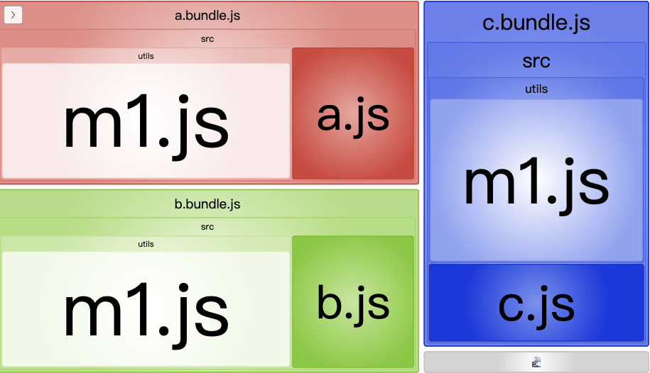

从分析图中可以比较直观的看出，三个输出 bundle 文件中都包含了 `m1.js` 文件，这就说明有重复的模块代码。splitChunks 的目的就是用来把重复的模块代码分离到单独的文件，以异步加载的方式来节省输出文件的体积。splitChunks 的配置项很多而且感觉官方文档的一些描述不是很清楚，下面通过一些重点配置属性和场景解释来帮助大家理解和弄懂如何配置 splitChunks。为方便理解和简单演示，webpack 和 splitChunks 的初始设置如下：

```javascript
const path = require('path');
const BundleAnalyzerPlugin =
  require('webpack-bundle-analyzer').BundleAnalyzerPlugin;

module.exports = {
  mode: 'development',
  entry: {
    a: './src/a.js',
    b: './src/b.js',
    c: './src/c.js',
  },
  output: {
    path: path.resolve(__dirname, 'dist'),
    filename: '[name].bundle.js',
    clean: true,
  },
  optimization: {
    splitChunks: {
      chunks: 'async',
      
      // 生成 chunk 的最小体积（以 bytes 为单位）。
      // 因为演示的模块比较小，需要设置这个。
      minSize: 0,
    },
  },
  plugins: [new BundleAnalyzerPlugin()],
};
```


## chunks

`splitChunks.chunks` 的作用是指示采用什么样的方式来优化分离 chunks，常用的有三种常用的取值：`async`、`initial` 和 `all`，`async` 是默认值，接下来分别看下这三种设置的区别。

### async

`chunks: 'async'` 的意思是只选择通过 `import()` 异步加载的模块来分离 chunks。举个例子，还是三个入口文件 `a.js`、`b.js` 和 `c.js`，有两个模块文件 `m1.js` 和 `m2.js`，三个入口文件的内容如下：

```javascript
// a.js
import('./utils/m1');
import './utils/m2';

console.log('some code in a.js');

// b.js
import('./utils/m1');
import './utils/m2';

console.log('some code in a.js');

// c.js
import('./utils/m1');
import './utils/m2';

console.log('some code in c.js');
```

这三个入口文件对于 `m1.js` 都是异步导入，`m2.js` 都是同步导入。打包输出结果如下：

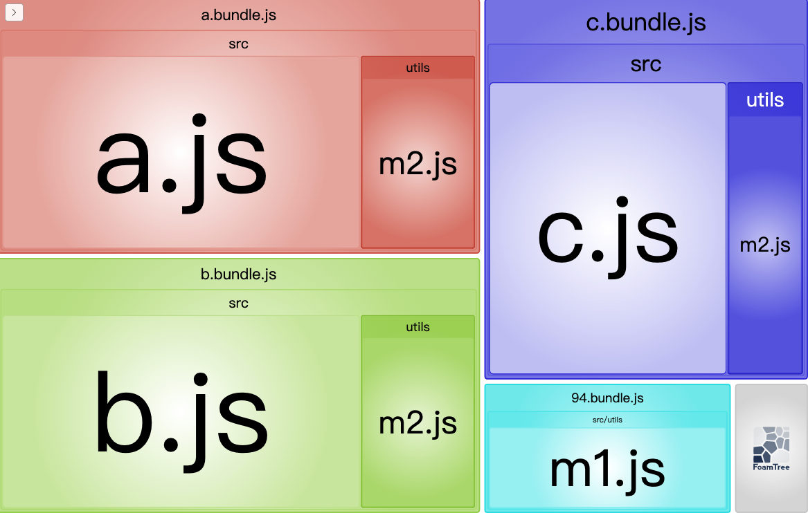

对于异步导入，splitChunks 分离出 chunks 形成单独文件来重用，而对于同步导入的相同模块没有处理，这就是 `chunks: 'async'` 的默认行为。

### initial

把 chunks 的这只改为 `initial` 后，再来看下输出结果：

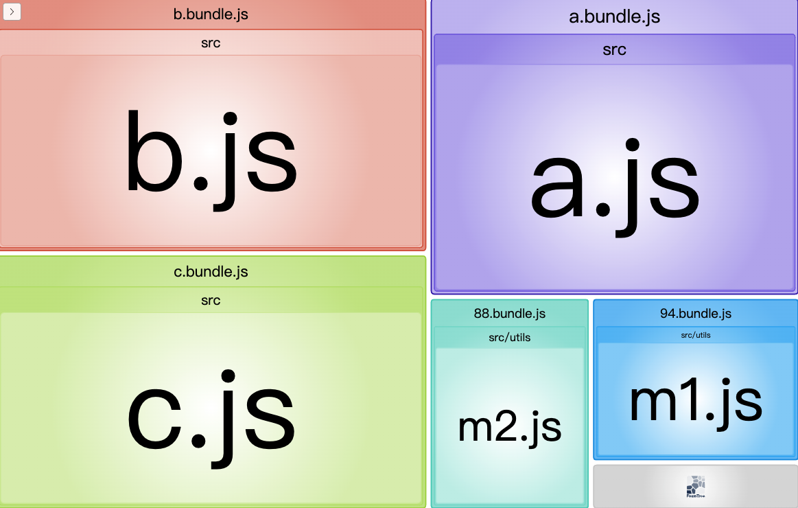

同步的导入也会分离出来了，效果挺好的。这就是 `initial` 与 `async` 的区别：同步导入的模块也会被选中分离出来。

### all

我们加入一个模块文件 `m3.js`，并对入口文件作如下更改：

```javascript
// a.js
import('./utils/m1');
import './utils/m2';
import './utils/m3'; // 新加的。

console.log('some code in a.js');

// b.js
import('./utils/m1');
import './utils/m2';
import('./utils/m3'); // 新加的。

console.log('some code in a.js');

// c.js
import('./utils/m1');
import './utils/m2';

console.log('some code in c.js');
```

有点不同的是 `a.js` 中是同步导入 `m3.js`，而 `b.js` 中是异步导入。保持 chunks 的设置为 `initial`，输出如下：

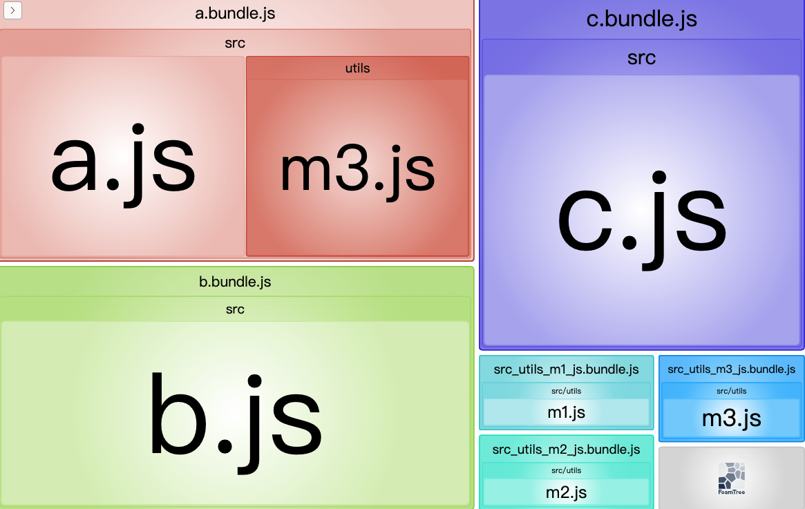

可以到看 `m3.js` 单独输出的那个 chunks 是 b 中异步导入的，a 中同步导入的没有被分离出来。也就是在 `initial` 设置下，就算导入的是同一个模块，但是同步导入和异步导入是不能复用的。

把 chunks 设置为 `all`，再导出康康：

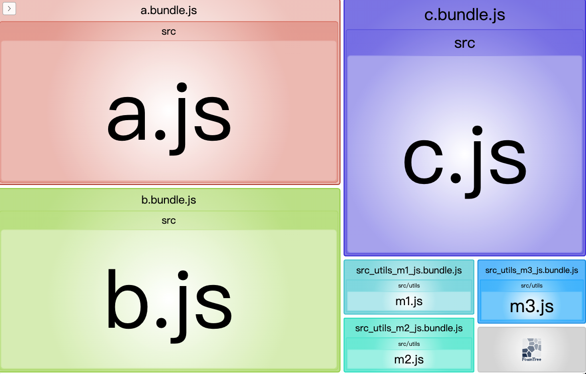

不管是同步导入还是异步导入，`m3.js` 都分离并重用了。所以 `all` 在 `initial` 的基础上，更优化了不同导入方式下的模块复用。

**这里有个问题**，发现 webpack 的 mode 设置为 `production` 的情况下，上面例子中 `a.js` 中同步导入的 `m3.js` 并没有分离重用，在 mode 设置为 `development` 时是正常的。不知道是啥原因，如果有童鞋知道的话麻烦解释下。

我们看到 `async`、`initial` 和 `all` 类似层层递进的模块复用分离优化，所以如果考虑体积最优化的输出，那就设 chunks 为 `all`。

## cacheGroups

通过 `cacheGroups`，可以自定义 chunk 输出分组。设置 `test` 对模块进行过滤，符合条件的模块分配到相同的组。splitChunks 默认情况下有如下分组：

```javascript
module.exports = {
  // ...
  optimization: {
    splitChunks: {
      // ...
      cacheGroups: {
        defaultVendors: {
          test: /[\\/]node_modules[\\/]/,
          priority: -10,
          reuseExistingChunk: true,
        },
        default: {
          minChunks: 2,
          priority: -20,
          reuseExistingChunk: true,
        },
      },
    },
  },
};
```

意思就是存在两个默认的自定义分组，`defaultVendors` 和 `default`，`defaultVendors` 是将 `node_modules` 下面的模块分离到这个组。我们改下配置，设置下将 `node_modules` 下的模块全部分离并输出到 `vendors.bundle.js` 文件中：

```javascript
const path = require('path');
const BundleAnalyzerPlugin =
  require('webpack-bundle-analyzer').BundleAnalyzerPlugin;

module.exports = {
  mode: 'development',
  entry: {
    a: './src/a.js',
    b: './src/b.js',
    c: './src/c.js',
  },
  output: {
    path: path.resolve(__dirname, 'dist'),
    filename: '[name].bundle.js',
    clean: true,
  },
  optimization: {
    splitChunks: {
      chunks: 'all',
      minSize: 0,
      cacheGroups: {
        vendors: {
          test: /[\\/]node_modules[\\/]/,
          priority: -10,
          reuseExistingChunk: true,
          name: 'vendors',
        },
      },
    },
  },
  plugins: [new BundleAnalyzerPlugin()],
};
```

入口文件内容如下：

```javascript
// a.js
import React from 'react';
import ReactDOM from 'react-dom';

console.log('some code in a.js');

// b.js
import React from 'react';

console.log('some code in a.js');

// c.js
import ReactDOM from 'react-dom';

console.log('some code in c.js');
```

输出结果如下：

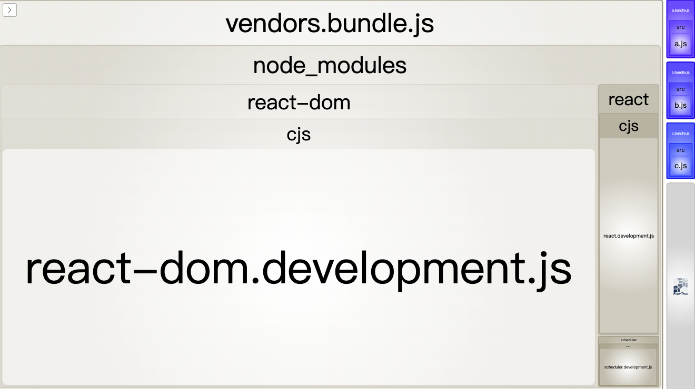

所以根据实际的需求，我们可以利用 `cacheGroups` 把一些通用业务模块分成不同的分组，优化输出的拆分。

举个栗子，我们现在输出有两个要求：

1. `node_modules` 下的模块全部分离并输出到 `vendors.bundle.js` 文件中。
2. `utils/` 目录下有一系列的工具模块文件，在打包的时候都打到一个 `utils.bundle.js` 文件中。

调整 webpack 中的设置如下：

```javascript
const path = require('path');
const BundleAnalyzerPlugin =
  require('webpack-bundle-analyzer').BundleAnalyzerPlugin;

module.exports = {
  mode: 'development',
  entry: {
    a: './src/a.js',
    b: './src/b.js',
    c: './src/c.js',
  },
  output: {
    path: path.resolve(__dirname, 'dist'),
    filename: '[name].bundle.js',
    clean: true,
  },
  optimization: {
    splitChunks: {
      chunks: 'all',
      minSize: 0,
      cacheGroups: {
        vendors: {
          test: /[\\/]node_modules[\\/]/,
          priority: -10,
          reuseExistingChunk: true,
          name: 'vendors',
        },
        default: {
          test: /[\\/]utils[\\/]/,
          priority: -20,
          reuseExistingChunk: true,
          name: 'utils',
        },
      },
    },
  },
  plugins: [new BundleAnalyzerPlugin()],
};
```

入口文件调整如下：

```javascript
// a.js
import React from 'react';
import ReactDOM from 'react-dom';
import('./utils/m1');
import './utils/m2';

console.log('some code in a.js');

// b.js
import React from 'react';
import './utils/m2';
import './utils/m3';

console.log('some code in a.js');

// c.js
import ReactDOM from 'react-dom';
import './utils/m3';

console.log('some code in c.js');
```

输出如下：

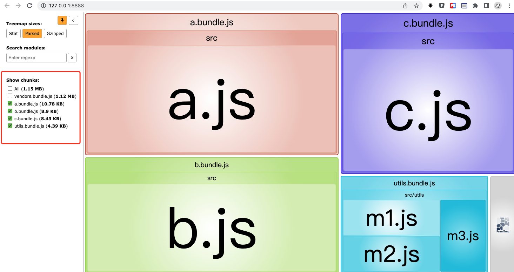

## maxInitialRequests 和 maxAsyncRequests

### maxInitialRequests

`maxInitialRequests` 表示入口的最大并行请求数。规则如下：

- 入口文件本身算一个请求。
- `import()` 异步加载不算在内。
- 如果同时有多个模块满足拆分规则，但是按 `maxInitialRequests` 的当前值现在只允许再拆分一个，选择容量更大的 chunks。

举个栗子，webpack 设置如下：

```javascript
const path = require('path');
const BundleAnalyzerPlugin =
  require('webpack-bundle-analyzer').BundleAnalyzerPlugin;

module.exports = {
  mode: 'development',
  entry: {
    a: './src/a.js',
  },
  output: {
    path: path.resolve(__dirname, 'dist'),
    filename: '[name].bundle.js',
    clean: true,
  },
  optimization: {
    splitChunks: {
      chunks: 'all',
      minSize: 0,
      maxInitialRequests: 2,
      cacheGroups: {
        vendors: {
          test: /[\\/]node_modules[\\/]/,
          priority: -10,
          reuseExistingChunk: true,
          name: 'vendors',
        },
        default: {
          test: /[\\/]utils[\\/]/,
          priority: -20,
          reuseExistingChunk: true,
          name: 'utils',
        },
      },
    },
  },
  plugins: [new BundleAnalyzerPlugin()],
};
```

入口文件内容如下：

```javascript
// a.js
import React from 'react';
import './utils/m1';

console.log('some code in a.js');
```

打包输出结果如下：

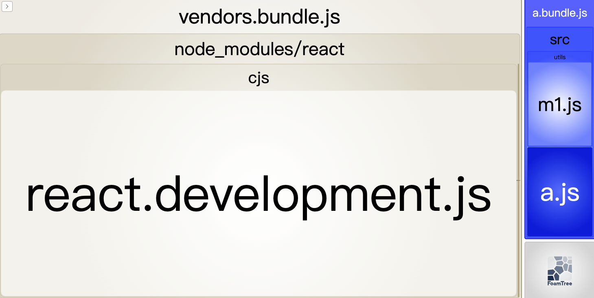

按照 `maxInitialRequests = 2` 的拆分过程如下：

- a.bundle.js 算一个文件。
- vendors.bundle.js 和 utils.bundle.js 都可以拆分，但现在还剩一个位，所以选择拆分出 vendors.bundle.js。

把 `maxInitialRequests ` 的值设为 3，结果如下：

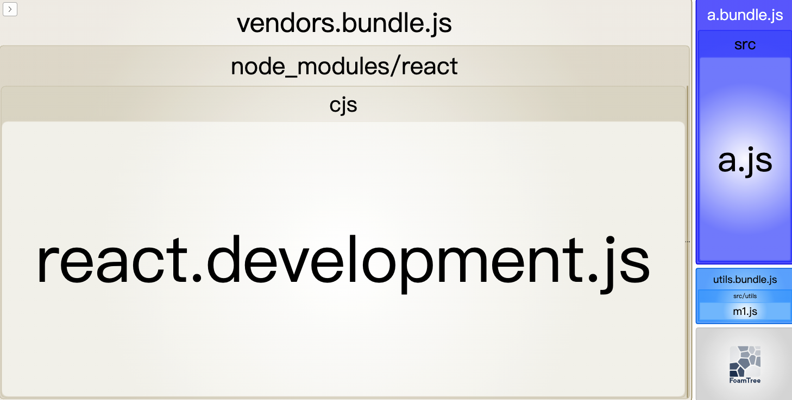

再来考虑另外一种场景，入口依然是 `a.js` 文件，`a.js` 的内容作一下变化：

```javascript
// a.js
import './b';

console.log('some code in a.js');

// b.js
import React from 'react';
import './utils/m1';

console.log('some code in b.js');
```

调整为 `a.js` 同步导入了 `b.js`，`b.js` 里再导入其他模块。这种情况下 `maxInitialRequests` 是否有作用呢？可以这样理解，`maxInitialRequests` 是描述的入口并行请求数，上面这个场景 `b.js` 会打包进 `a.bundle.js`，没有异步请求；`b.js` 里面的两个导入模块按照 `cacheGroups` 的设置都会拆分，那就会算进入口处的并行请求数了。

比如 `maxInitialRequests` 设置为 2 时，打包输出结果如下：

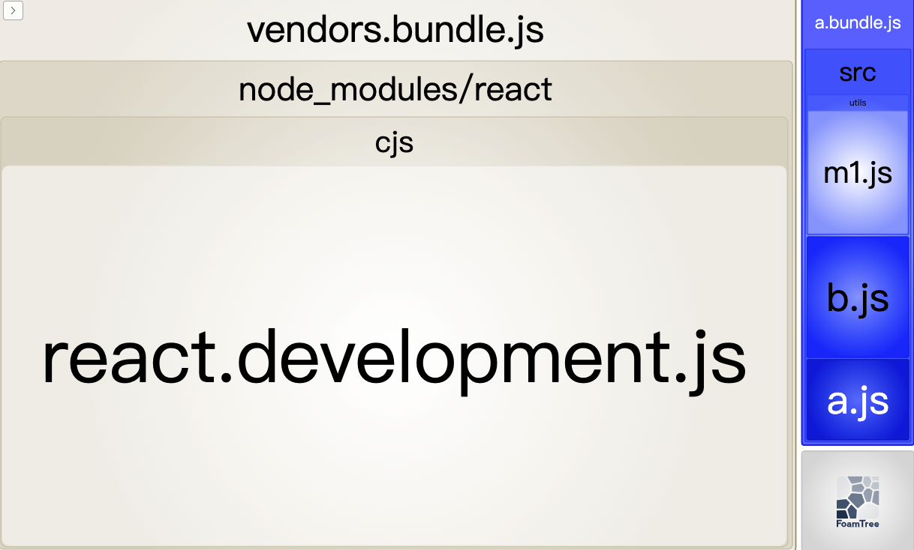

设置为 3 时，打包输出结果如下：

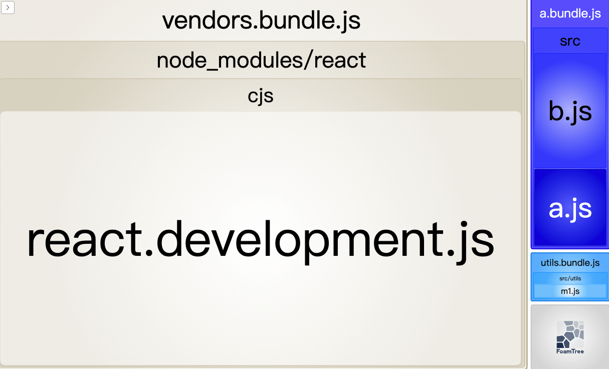

### maxAsyncRequests

`maxAsyncRequests` 的意思是用来限制异步请求中的最大并发请求数。规则如下：

- `import()` 本身算一个请求。
- 如果同时有多个模块满足拆分规则，但是按 `maxAsyncRequests` 的当前值现在只允许再拆分一个，选择容量更大的 chunks。

还是举个栗子，webpack 配置如下：

```javascript
const path = require('path');
const BundleAnalyzerPlugin =
  require('webpack-bundle-analyzer').BundleAnalyzerPlugin;

module.exports = {
  mode: 'development',
  entry: {
    a: './src/a.js',
  },
  output: {
    path: path.resolve(__dirname, 'dist'),
    filename: '[name].bundle.js',
    clean: true,
  },
  optimization: {
    splitChunks: {
      chunks: 'all',
      minSize: 0,
      maxAsyncRequests: 2,
      cacheGroups: {
        vendors: {
          test: /[\\/]node_modules[\\/]/,
          priority: -10,
          reuseExistingChunk: true,
          name: 'vendors',
        },
        default: {
          test: /[\\/]utils[\\/]/,
          priority: -20,
          reuseExistingChunk: true,
          name: 'utils',
        },
      },
    },
  },
  plugins: [new BundleAnalyzerPlugin()],
};
```

入口及相关文件内容如下：

```javascript
// a.js
import ('./b');

console.log('some code in a.js');

// b.js
import React from 'react';
import './utils/m1';

console.log('some code in b.js');
```

这个时候是异步导入 `b.js` 的，在 `maxAsyncRequests = 2` 的设置下，打包输出结果如下：

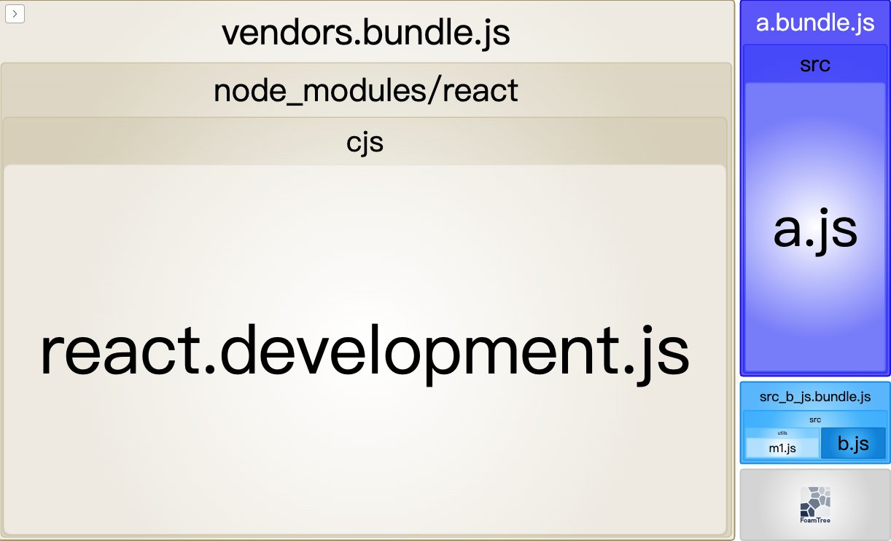

按照规则：

-  `import('.b')` 算一个请求。
-  按 chunks 大小再拆分 `vendors.bundle.js`。

最后 `import './utils/m1'` 的内容留在了 `b.bundle.js` 中。如果将 `maxAsyncRequests = 3` 则输出如下：

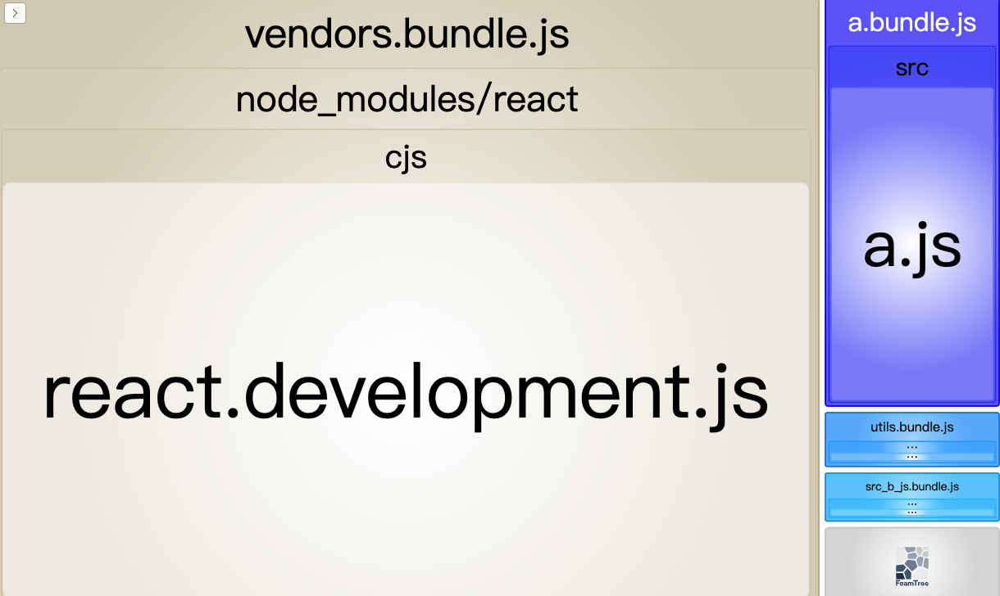

这样 `b.js` 中导入的 `m1.js` 也被拆分出来了。实际情况中，我们可以根据需求来调整 `maxInitialRequests` 和 `maxAsyncRequests`，个人觉得默认设置已经够用了。

## 总结

splitChunks 的设置非常复杂。通过以上的规则讲解和举例，相信大家已经明白拆包中几个关键属性的使用，我个人觉得也是官方文档解释比较迷的几个，剩余的其他属性大家可以通过官方文档找到答案。