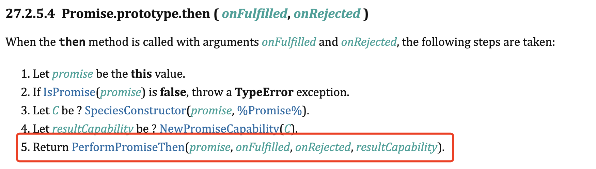
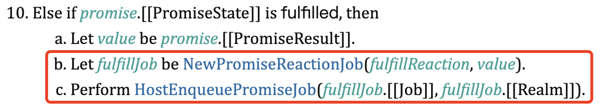
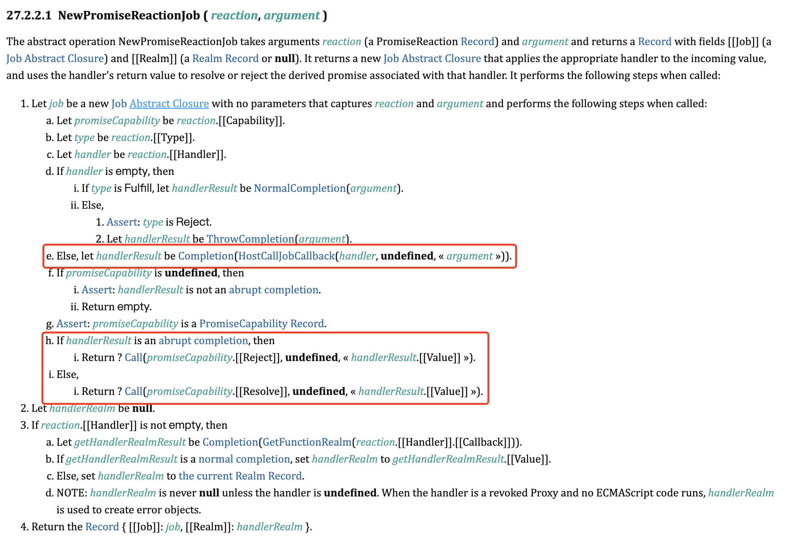
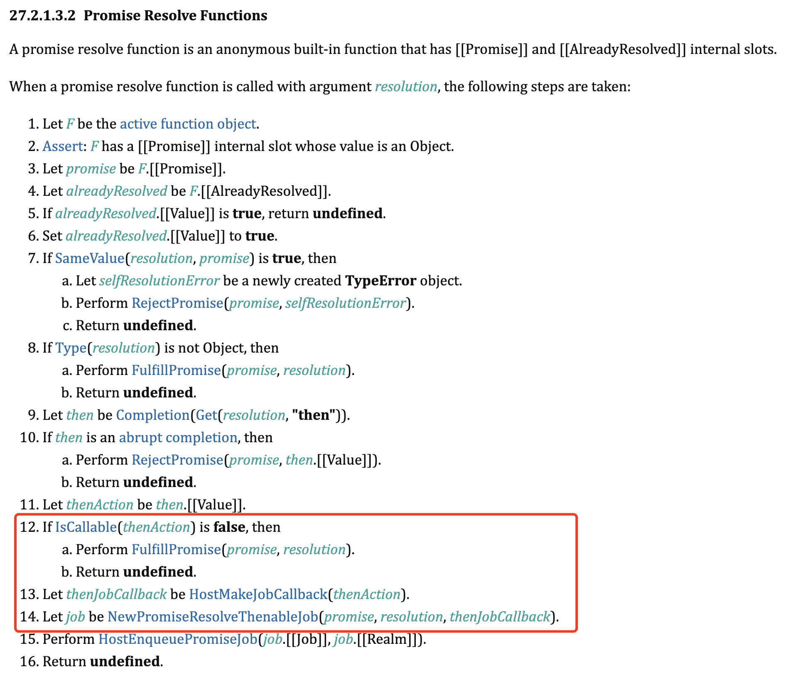
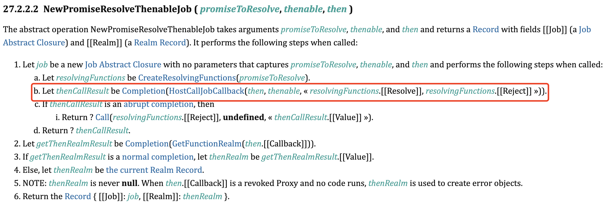

## 一道示例题引发的知识盲区

```javascript
// promise1
new Promise(resolve => {
  resolve(
    new Promise(resolve => {
      resolve(1);
    })
  );
}).then(res => {
  console.log('1');
});

new Promise(resolve => {
  resolve(2);
})
  .then(() => {
    console.log('2');
  })
  .then(() => {
    console.log('3');
  })
  .then(() => {
    console.log('4');
  });

// 输出顺序：
// 2
// 3
// 1
// 4
```

先来看一道示例题。按照以往的理解，我以为输出顺序是 `2 1 3 4`。然后通过调试发现 promise1 在初始化后状态依然是 pending，感觉自己在理解 Promise 微任务方面还是存在不足。研究了下 ECMA 规范，终于把这个问题搞清楚了。

## 微任务的类型

ECMA 规范中把 Promise 微任务分成了两种类型，下面结合规范来分别看下这两种微任务的产生时机和执行内容。

### NewPromiseReactionJob

当 Promise 决议后执行 `then()` 中注册的回调时，或当 `then()` 注册时 Promise 已决议，会产生这种微任务。为简化说明，我们先关注这个场景：当前 Promise 已经决议，接着调用了 `then()`，比如这样：

```javascript
Promise.resolve(1).then(res => console.log(res));
```

`res => console.log(res)` 就运行在这种微任务中。来看规范对于 Promise.prototype.then 的描述：



因为 Promise 已经是 fulfilled 状态，我们接着看 PerformPromiseThen 中对于 fulfilled 状态的操作：



这里就是创建了一个 NewPromiseReactionJob 微任务，并加入到了微任务队列中。我们再看看 NewPromiseReactionJob 里面是怎么执行的：



该微任务主要包含两个内容：

1. 执行 handler，handler 就是 then() 中注册的回调，得到返回结果。
2. 对 then() 中产生的新 Promise 执行 resolve(返回结果) 或 reject(返回结果)。

### NewPromiseResolveThenableJob

上面那种微任务基本是大家熟知的情况，这个微任务类型就是示例题中提到的盲区了。首先注意到 resolve 函数的描述：



如果一个对象的 `then` 属性可以被调用（是一个函数），那么这个对象就是 `thenable` 对象。调用 `resolve()` 传递的参数值如果是一个 `thenable` 对象，就会产生 NewPromiseResolveThenableJob 这种微任务了。接下来看看这个微任务的内容：



大概意思就是这种微任务产生了如下的代码：

```javascript
// resovle 和 reject 是调用 resolve(thenable) 时那个 Promise 上的。
thenable.then(resolve, reject); 
```

那么结合第一种微任务，如果 `thenable` 对象是 Promise，则这个微任务执行后又会产生第一个微任务。为什么要这样做呢？规范上有一段解释：

> This Job uses the supplied thenable and its `then` method to resolve the given promise. This process must take place as a Job to ensure that the evaluation of the `then` method occurs after evaluation of any surrounding code has completed.

直接翻译的话大概就是说要等周围的同步代码执行完后才会执行这个。关于这个设计意图，我的理解是考虑到 `thenable` 对象的不一定是 Promise 实例，也可能是用户创建的任何对象；如果这个对象的 `then` 是同步方法，那么这样做就可以保证 `then` 的执行顺序也是在微任务中。

## 示例题分析

我们再来分析一下示例题：

```javascript
// promise1
new Promise(resolve => {
  resolve(
    // promise2
    new Promise(resolve => {
      resolve(1);
    })
  );
}).then(res => {
  console.log('1');
});

// promise3
new Promise(resolve => {
  resolve(2);
})
  .then(() => {
    console.log('2');
  })
  .then(() => {
    console.log('3');
  })
  .then(() => {
    console.log('4');
  });
```

代码执行后，我们用伪代码来表示下微任务队列的内容：

```javascript
const microTasks = [
  function job1() {
    promise2.then(promise1.[[Resolve]], promise1.[[Reject]]);
  },
  function job2() {
    const handler = () => {
      console.log('2');
    };
    
    // 决议 then() 返回的新 Promise。
    resolve(handler(2));
  }
];
```

接着开始执行微任务队列。job 1 执行后，产生了新的微任务 job 3：

```javascript
const microTasks = [
  function job2() {
    const handler = () => {
      console.log('2');
    };
    resolve(handler(2));
  },
  function job3() {
    const handler = promise1.[[Resolve]];
    resolve(handler(1));
  }
];
```

job 2 执行后，输出了 `2`，并且产生新的微任务 job 4：

```javascript
const microTasks = [
  function job3() {
    const handler = promise1.[[Resolve]];
    resolve(handler(1));
  },
  function job4() {
    const handler = () => {
      console.log('3');
    };
    resolve(handler(undefined));
  }
];
```

注意到 job 3 的内容是会让 promise1 决议，那么就会执行 promise1 的 then 回调，则会再产生一个微任务 job 5；并且 job 4 执行完后输出变为 `2 3`，并让 then() 产生的新 Promise 决议，也会再产生下一个的微任务 job 6：

```javascript
const microTasks = [
  // job 5 由 job 3 产生。
  function job5() {
    const handler = () => {
      console.log('1');
    };
    resolve(handler(1));
  },
  function job6() {
    const handler = () => {
      console.log('4');
    };
    resolve(handler(undefined));
  }
];
```

那么最后的输出结果就是 `2 3 1 4` 啦，大家可以把以上分析方法放在其他的题目中验证康康是不是对的。

如果对本篇有疑问或建议，欢迎在 [这里](https://github.com/deepfunc/js-bullshit-blog/issues/6) 提出。

## 参考资料

- [ECMAScript® 2023 Language Specification - Promise Objects](https://tc39.es/ecma262/#sec-promise-objects)

