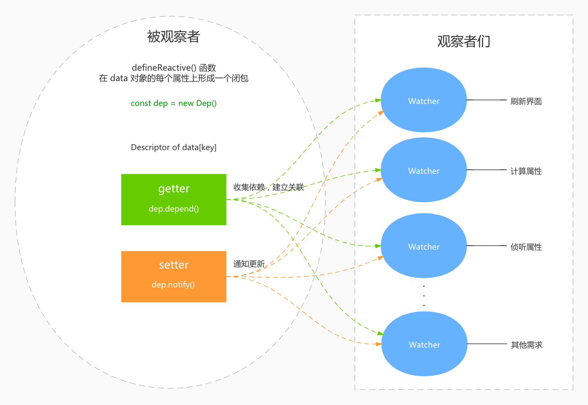

Vue 的响应式系统是 Vue 最有意思的特性之一，`data` 只需要返回一个普通的字面量对象，在运行时修改它的属性就会引起界面的更新。现在都是数据驱动界面开发，这种设计对于程序员开发来说非常爽，关注点只用放在数据变化的逻辑上。并且 Vue 把这个特性抽象成了一个独立的 `observer` 模块，可以单独剥离使用，比如小程序开发框架 [Wepy](https://github.com/Tencent/wepy) 就采用了这个模块来实现响应式。

这段时间我看了 Vue 2.x 关于 `observer` 的源码，这里呢也谈一下我对 `observer` 设计与关键部分实现的理解，以下的内容是基于 Vue 2.x 的源码分析。虽然现在已经有很多分析 Vue 响应式的文章了，希望我的理解也能给读者一些启发吧，把这块儿的知识吸收为自己所用。


## 如何追踪数据改变？

响应式最核心的问题是：如何去追踪 `data` 对象的属性改变呢？如果这一点无法实现或者对于开发者来说编码体验不好，那么响应式设计后面的路就不好走了。Vue 2.x 这里是基于 `Object.defineProperty` 来做的，将这些属性全部包装上 `getter/setter`，也就是劫持对象的属性访问。这种实现方式对于开发者来说基本是完全无感的。下面我摘出关键的代码片段来说明一下是如何实现的（假定我们设置的 `data` 是一个普通的字面量对象），如果你只是想学习设计思路也没必要去看完整的源码。


首先在 `src/core/instance/state.js` 中有如下代码：

```javascript
function initData (vm: Component) {
  // 这就是我们声明的 data 数据对象，vm 是 Vue 对象
  let data = vm.$options.data
  
  // ...
  
  // 观察 data
  observe(data, true /* asRootData */)
}
```


上面这段代码是初始化 Vue 对象的 `data`，然后对 `data` 对象进行了观察设置。我们跳转到 `observe()` 的部分：

```javascript
export function observe (value: any, asRootData: ?boolean): Observer | void {
  // ...
  let ob: Observer | void
  // 先不关注
  if (hasOwn(value, '__ob__') && value.__ob__ instanceof Observer) {
    ob = value.__ob__
  } else if (
    shouldObserve && // 这里有一堆的条件，先不关注...
  ) {
    // 关注这里！
    ob = new Observer(value)
  }  
}
```


这里出现了一个 `Observer` 类，并且传入了 value 参数，就是我们设置的 `data` 对象，这里就是怎么劫持属性访问的关键类了，我们跳转到 `Observer` 的源码，在 `Observer` 构造函数中会调用这么一段代码：

```javascript
export class Observer {
	// ...
  
  constructor (value: any) {
    // 依然省略大量代码...
    
    if (Array.isArray(value)) {
      // 先不考虑数组
    } else {
      // 看这里
      this.walk(value)
    }
  }
}
```


这里出现了一个 `walk()` 方法，把 `data` 作为参数传递进去了，来看看 `walk()` 是什么：

```javascript
walk (obj: Object) {
  const keys = Object.keys(obj)
  for (let i = 0; i < keys.length; i++) {
    // 终于到了这里...
    defineReactive(obj, keys[i])
  }
}
```


这个 `walk()` 里面去遍历了 `data` 的所有自身属性，然后对每个 key 调用了 `defineReactive()` 函数。`defineReactive()` 从这个名字来看就是“定义响应的”，并且第一个参数是传入的 `data`，第二个参数是属性 key，看来就是针对 `data` 的每个 `key` 去设置对应的属性如何进行响应式了，到这里我们终于找到了劫持的大门~


### 劫持

`defineReactive()` 函数主要通过重新定义 `data` 上每个 `key` 的[属性描述符](https://developer.mozilla.org/zh-CN/docs/Web/JavaScript/Reference/Global_Objects/Object/defineProperty)来达到挟持属性访问的目的。利用 `Object.defineProperty` 为每个属性定义新的存取描述符，然后利用存取描述符的 `getter/setter` 来劫持属性的存取。


**到这里我们要思考一个问题，我们能直接在 `setter` 里面去触发界面的更新吗？**

响应式设计有很多的应用场景，比如 Vue 提供了计算属性 `computed` 和侦听属性 `watch`。如果我们把更新界面的操作直接写到 `setter` 里面的话，当再出现多一种场景需求的时候就需要在 `setter` 里面多加一段代码。一旦这样做了，就会频繁的修改 `setter`，这段代码就会变得不稳定和脆弱。所以我们要避免这种坏设计（bad design），而应该将这段代码**封闭**起来，使它能适应未来的**扩展**。


### 抽象

> **Abstraction is the Key**.

方向确定了，就要寻找一种实现方案。这里我们先对响应式这种需求做一层抽象：**某个用户代码需要在 data 的某些属性发生变化时得到通知，从而执行特定的任务（代码）**。

某个用户代码是未知的，得到通知后需要执行的任务代码也是未知的，我们唯一知道的是：用户代码关心 `data` 某些属性的变化并期望得到通知。基于以上的抽象，我们很容易就想到**观察者**模式了~

在 Vue 的响应式设计里，`data` 数据对象的属性是被观察者，刷新界面、计算属性和侦听属性都属于观察者。这些观察者**订阅** `data` 中他们感兴趣的部分（也就是 `key` 对应的对象属性），当这些属性发生变化后，被观察者**发布**通知，观察者就去执行他们自己的任务了~

首先假设一下，一旦这个模式被设计编码出来，是一个好的设计吗？针对响应式的场景需求，我们只需要为每个属性建立一个观察者的关联列表，当属性改变时去挨个通知这些观察者就好了，而这些观察者是谁我们并不需要关心，这样就实现了我们抽象的目的。


这里先给一张图看看 Vue 是怎么设计的：




`Dep` 类记录了依赖关系，`Watcher` 就是抽象的观察者。那 Vue 是怎么建立依赖关系的呢？下面就来逐一解析下。


### 记录依赖关系

我们先想一下依赖关系在什么时候去收集是合适的？

如上面讨论的，Vue 中的观察者比如计算属性等是一个函数，在函数的执行过程中会读取 `data`  的若干属性，这就意味会访问到属性的 `getter`。那么自然把收集依赖的任务放在 `getter` 里面是合适的，那具体要怎么设计怎么实现呢？


我们还是先从关键代码入手，来看看 `defineReactive()` 中 `getter` 的代码：

```javascript
const dep = new Dep()
// ...

get: function reactiveGetter () {
  const value = getter ? getter.call(obj) : val
  if (Dep.target) { // Dep.target 就是当前的观察者
    dep.depend() // 建立依赖关系
    // ...
  }
  return value
},
```

在 `getter` 里会判断 `Dep.target` 是不是有值（当前的观察者），如果有值的话就执行 `dep.depend()` 建立依赖关系。这里 `Dep.target` 为什么就是当前的观察者呢？

前面我们说过了观察者都被抽象成了 `Watcher`。`Watcher` 的构造函数会传入一个 `expOrFn`（就是客户代码，比如：计算属性的定义函数），然后被保存为一个叫 `getter` 的成员。在 `Watcher` 构造函数的最后会执行 `Watcher` 的 `get()` 方法，`get()` 的关键部分如下：

```javascript
get () {
  pushTarget(this) // 这里设置 Dep.target
  let value
  const vm = this.vm
  try {
    value = this.getter.call(vm, vm)
  } catch (e) {
    // ...    
  } finally {
    popTarget() // 运行完 getter 后取消设置 Dep.target
    // ...
  }
  return value
}
```


看到这里我们就大致明白了，每个 `Watcher` 在执行客户代码以前，会把自己设置为 `Dep.target`，并在运行完客户代码后取消 `Dep.target` 的设置，`pushTarget()` 和 `popTarget()` 的代码如下：

```javascript
Dep.target = null
const targetStack = []

export function pushTarget (target: ?Watcher) {
  targetStack.push(target)
  Dep.target = target
}

export function popTarget () {
  targetStack.pop()
  Dep.target = targetStack[targetStack.length - 1]
}

// 为什么会有 targetStack 数组 将在以后的文章中解析
```


`Watcher` 中的 `get()` 方法结合 `defineReactive()` 中 `getter` 的部分我们终于大致知道是如何收集依赖了：

**每段客户代码都被抽象为` Watcher` 中的 `getter` 并被包裹在 `get()` 中执行，在执行前 `Dep.target` 设置为 `Watcher` 自身，执行完后取消设置。**


#### 依赖关系发生变化

Vue 记录了依赖的双向关系。`Dep` 上有个 `subs` 数组记录了观察这个属性的观察者们，每个观察者 `Watcher` 有个 `deps` 数组记录了需要观察的属性相关 `Dep` 实例。这里有点奇怪的是为什么需要记录双向关系呢，如果只是通知观察者的话，只需要在 `Dep` 上的 `subs` 数组就好了呀:question:

这是因为 `Watcher` 需要在某些场景去除掉一些不再需要的依赖关系，那么就需要比对原先的依赖 `deps` 数组和当前最新的依赖数组之间的差异（所以 `Watcher` 有配合的 `depIds`、`newDepIds`、`newDeps` 来做这件事）。那什么场景会产生依赖关系的变化呢？比如，在计算属性的函数中，根据某些逻辑变量的判断来引用不同的 `data` 属性，那么这种情况下依赖关系就会产生变化，用一段代码来说明下： 

```javascript
const vm = new Vue({
  el: '#demo',
  data: {
    a: 1,
    b: 2,
    c: false
  },
  computed: {
    some: function () {
      if (c) {
        return a + b
      } else {
        return b
      }
    }
  }
})
```

如果 `c` 的值是 `true`，计算属性 `some` 依赖的 `data` 属性是 `a` 和 `b`；如果 `c` 的值改变成了 `false`，则 `some` 就只依赖 `b` 了。所以在业务场景中，依赖关系确实有可能会发送变化的。


### 通知更新

记录了依赖关系后，当属性发生变化时去通知就很简单了。回到 `defineReactive()` 中的 `setter` 代码：

```javascript
const dep = new Dep()
// ...

set: function reactiveSetter (newVal) {
  // ...
  
  // 前面的按下不表，以后再解释，先只关注这句话
  dep.notify()
}
```

当属性被赋值时，就执行 `dep.notify()`，里面会逐个去通知 `Watcher` 执行 `update()`。后面我们会详细再说下 `update()` 的过程，这里我们只需要知道更新通知是怎么发生的就行了。


## 接下来

以上就是我理解的 Vue 响应式是如何去设计的，以及依赖收集的关键代码解读。我觉得一个好的框架或者第三方库他们的设计思路和抽象方式是非常值得我们去学习的，我们常说的看源码学习主要也是学的这部分。其次要关注作者在实现上的一些技巧，比如这里的依赖收集方式就是比较有特点的。

水平有限，理解和解读难免会有错漏，欢迎指出哇~ 下一篇将写一下计算属性的一些设计、实现和其他部分。

