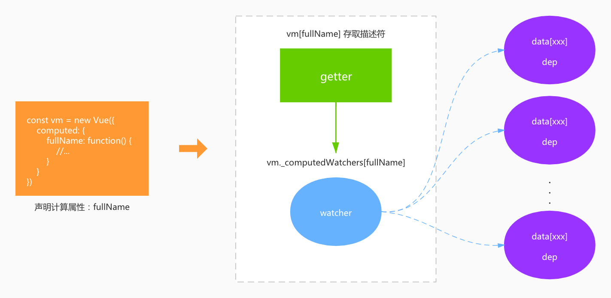

Hi，大家好~ 在上一篇 [Vue2响应式原理解析（一）：从设计出发](https://github.com/deepfunc/js-bullshit-blog/blob/master/%E6%BA%90%E7%A0%81%E8%A7%A3%E6%9E%90/Vue2%E5%93%8D%E5%BA%94%E5%BC%8F%E5%8E%9F%E7%90%86%E8%A7%A3%E6%9E%90%EF%BC%88%E4%B8%80%EF%BC%89%EF%BC%9A%E4%BB%8E%E8%AE%BE%E8%AE%A1%E5%87%BA%E5%8F%91/Vue2%E5%93%8D%E5%BA%94%E5%BC%8F%E5%8E%9F%E7%90%86%E8%A7%A3%E6%9E%90%EF%BC%88%E4%B8%80%EF%BC%89%EF%BC%9A%E4%BB%8E%E8%AE%BE%E8%AE%A1%E5%87%BA%E5%8F%91.md) 中我讲了一下 Vue2 是如何抽象和设计响应式的， `data` 是如何实现响应式的，包括依赖收集和双向依赖记录的设计思路和关键代码。在这一篇中，我们来一起康康 Vue 中非常强大的响应式功能：计算属性。我主要会从功能需求的角度来分析计算属性的实现和关键代码，希望能带给大家一些在别的文章里看不到的东西吧。以下内容请先看过 [第一篇](https://github.com/deepfunc/js-bullshit-blog/blob/master/%E6%BA%90%E7%A0%81%E8%A7%A3%E6%9E%90/Vue2%E5%93%8D%E5%BA%94%E5%BC%8F%E5%8E%9F%E7%90%86%E8%A7%A3%E6%9E%90%EF%BC%88%E4%B8%80%EF%BC%89%EF%BC%9A%E4%BB%8E%E8%AE%BE%E8%AE%A1%E5%87%BA%E5%8F%91/Vue2%E5%93%8D%E5%BA%94%E5%BC%8F%E5%8E%9F%E7%90%86%E8%A7%A3%E6%9E%90%EF%BC%88%E4%B8%80%EF%BC%89%EF%BC%9A%E4%BB%8E%E8%AE%BE%E8%AE%A1%E5%87%BA%E5%8F%91.md) 再来比较好~


## 计算属性 computed

在 Vue 的 [文档](https://cn.vuejs.org/v2/guide/computed.html) 中有提到计算属性的设计初衷是为了解决模板内表达式过于复杂、难以理解。当然解决此问题还有一个方案就是用 `methods` 中定义的方法，但计算属性有个非常强大的特性：缓存。这意味着计算属性依赖的数据如果没有发生变化，则再次访问计算属性时就不会重新计算，直接返回缓存的结果，这对于计算复杂的场景非常实用。

那计算属性的实现怎么和前面我们讲过的响应式设计结合起来呢~？这里我们先看一张图：



这张图描述的就是当你声明了一个计算属性后（这里举的栗子就是声明 `fullName` 计算属性），Vue 转换成了图右边的 `getter` + `watcher` 的结构来实现计算属性的所有功能。如果看起来有点懵逼的话不要急，下面就来一一揭秘计算属性是如何实现和工作的。


### 实现细节

首先来到 `src/core/instance/state.js` 文件，有个 `initComputed` 函数，这个函数就是初始化计算属性的地方，下面我们来看看关键部分的代码：

```javascript
function initComputed (vm: Component, computed: Object) {
  // vm 对象上增加了 _computedWatchers 存放计算属性对应的 watcher
  const watchers = vm._computedWatchers = Object.create(null)
  
  // ...
  
  for (const key in computed) {
    // 计算属性支持 setter，为了简洁说明重点我们只关注计算属性声明为函数的情况哈
    const getter = typeof userDef === 'function' ? userDef : userDef.get
    
    // ...
    // 服务器端渲染的情况也先不关注哈
    if (!isSSR) {
      // 注意这里，每个计算属性对应生成了一个 watcher，并把计算属性的函数作为 getter 传进去了
      watchers[key] = new Watcher(
        vm,
        getter || noop,
        noop,
        computedWatcherOptions
      )
    }
    
    if (!(key in vm)) {
      // 这里就是在 vm 对象上定义计算属性的描述符了
      defineComputed(vm, key, userDef)
    }
    // ...
  }
}
```

这就是计算属性的主要实现过程。首先呢，我们先把视角拉高一点，只关注重点流程，不要陷入太多细节哈，细节后面会讲到。重点流程就是上面那张图上描述的：Vue 为每个计算属性生成了一个 `watcher`，并在 `vm` 对象上声明了跟计算属性同名的存取描述符，一会他们俩要配合使用。这里需要注意的是 Watcher 构造函数传入的 `computedWatcherOptions`，这个对象有个 ` lazy: true` 的属性，待会就知道是干嘛用的了。


### 从计算属性的使用入手来讲缓存

下面就是计算属性实现的细节和精华部分了。首先我们来到上面说的 `defineComputed` 函数，依然去掉一些神马服务端渲染逻辑的干扰，只看主要实现细节的代码：

```javascript
export function defineComputed (
  target: any,
  key: string,
  userDef: Object | Function
) {
  // 先不管服务器端渲染
  const shouldCache = !isServerRendering()
  if (typeof userDef === 'function') {
    // 注意这里调用了 createComputedGetter 来生成描述符的 getter
    sharedPropertyDefinition.get = shouldCache
      ? createComputedGetter(key)
      : createGetterInvoker(userDef)
    // ...
  }
  // ...
  
  // 在 vm 上生成计算属性同名的存取描述符
  Object.defineProperty(target, key, sharedPropertyDefinition)
}
```

在 `defineComputed` 里我们看到，最终描述符的 `get` 是由 `createComputedGetter` 生成的，这个函数就是关键中的关键了~


在继续之前，我们先回想一下计算属性的使用场景和缓存的应用。通常我们定义好计算属性之后，就会在 `template` 里去使用。当界面第一次显示时，计算属性会计算值，除非计算属性的依赖项发生变化（比如：依赖的 `data` 对象的属性重新赋值了），否则后面的刷新不会导致计算属性重新计算，而是会直接返回上一次的缓存值。从这里可以看出，`template` 里去读取计算属性的值，实际上就是调用 `vm` 上计算属性描述符的 `get` 了。


理清了场景后，我们把 `createComputedGetter` 分为两部分来看，先关注跟缓存相关的前半部分代码：

```javascript
function createComputedGetter (key) {
  return function computedGetter () {
    // 首先在这里取到 vm 上的 watcher
    const watcher = this._computedWatchers && this._computedWatchers[key]
    if (watcher) {
      if (watcher.dirty) {
        watcher.evaluate()
      }

      // ...
      return watcher.value
    }
  }
}
```

上面代码中的 `watcher.dirty` 就是表示计算属性当前的值是否需要重新计算，如果不需要重新计算就直接返回 `watcher.value` 了，这就是实现了缓存的作用。那么这里我们回想一下计算属性在初始化 `watcher` 的时候传入了一个  `lazy: true`，并且在 `Watcher` 的构造函数中有这样的逻辑：

```javascript
export default class Watcher {
  // ...
  
  constructor (
    vm: Component,
    expOrFn: string | Function,
    cb: Function,
    options?: ?Object,
    isRenderWatcher?: boolean
  ) {
    // ...
    this.lazy = !!options.lazy
    // ...
    this.dirty = this.lazy // 是不是脏了需要求值，初始化的时候就是 true
    //...
    // 如果是计算属性，初始化 watcher 不会求值
    this.value = this.lazy
      ? undefined
      : this.get()
  }
}
```

这个意思就是说：如果是计算属性，初始化 `watcher` 时不会求值，只会标记脏了——缓存无效。那么在上面计算属性的 `get` 第一次被调用时 `watcher.dirty`（界面第一次显示），会调用 `watcher.evaluate()`：

```javascript
evaluate () {
  this.value = this.get()
  this.dirty = false
}
```

在 `evaluate` 里就执行 `get()` 去求值了，并且标记缓存有效。回想一下当依赖的 `dep` 发生 `set` 时，会执行 `watcher.update()`：

```javascript
update () {
  if (this.lazy) {
    // 如果是计算属性，这里就会标记为 dirty
    this.dirty = true
  }
  // ...
}
```

所以依赖发生变化，缓存就会失效，计算属性又会重新计算了~


以上就是计算属性缓存的设计和实现细节了，我尽量只摘取关键代码把关键的事情说清楚。**这个地方我们需要注意的是，Vue 把计算属性这种场景抽象成一种 `lazy watcher`，lazy watcher 只在需要的时候计算值，并且有缓存功能！所以抽象能力是值得我们学习的地方~**


### 依赖传递

我们回过头来看看 `createComputedGetter` 的后半部分代码：

```javascript
function createComputedGetter (key) {
  return function computedGetter () {
    const watcher = this._computedWatchers && this._computedWatchers[key]
    if (watcher) {
      // 前面代码是判断缓存是否要更新
      // ...
      
      // 注意这里就是依赖传递了
      if (Dep.target) {
        watcher.depend()
      }
      return watcher.value
    }
  }
}
```

前半部分的缓存已经讲过了，现在我们注意这里有个依赖传递的逻辑，这是什么意思呢？


这里我们还是用场景来举例吧。比如在计算属性的声明中你是可以引用另外一个计算属性的！因为计算属性在初始化 ` watcher` 时不会求值，也就是 `lazy watcher`，所以这样是没问题的。比如下面的代码：

```javascript
const vm = new Vue({
  el: '#demo',
  data: {
    a: 1,
    b: 2
  },
  computed: {
    c: function () {
      return a + b
    },
    d: function () {
      return c * 2
    }
  }
})
```

这里就用这个简单的例子来说明为什么需要依赖传递：计算属性 `c` 依赖了 `data` 上的 `a` 和 `b`，计算属性 `d` 又依赖了 `c`。那么问题来了，当 `a` 和 `b` 发生改变时 `c` 会 `dirty`，当然 `d` 也需要 `dirty`，不然 `d` 就会有缓存不会重新求值了。那么 `d` 怎么得到通知呢？


关键的代码就是上面的 `watcher.depend()` 了。首先，`d` 取值时会调用 `d` 自身的 `watcher.get()`，这个时候会把 `d` 的 `watcher` 设置为 `Dep.target`；接着 `c` 的 `watcher.get()` 执行时也会把 `c` 的 `watcher` 设置为 `Dep.target`。这里注意了，设置 `Dep.target` 时是调用的 `pushTarget`，这个函数会调用 `targetStack` 数组把当前已经记录的 `Dep.target` 推入数组：

```javascript
Dep.target = null
const targetStack = []

export function pushTarget (target: ?Watcher) {
  targetStack.push(target)
  Dep.target = target
}

export function popTarget () {
  targetStack.pop()
  Dep.target = targetStack[targetStack.length - 1]
}

// 当时说了 targetStack 数组将在以后的文章中解析，这里圆回来了
```

执行完了这些之后呢，`c` 的 `watcher` 首先和 `a` 和 `b` 的 `dep` 建立了依赖关系，然后求值 `watcher.evaluate()`。求值完后也就是 `c` 执行完自己的 `watcher.get()`，注意在 `get()` 方法的最后执行了 `popTarget()`，也就是说 `c` 把自己的 `watcher` 弹出来了，目前的 `Dep.target` 又变成了 `d` 的 `watcher`！


当 `c` 求值完后，如果当前还有 `Dep.target` 存在就会执行 `watcher.depend()` 来传递依赖了，我们来看看 `watcher.depend()` 到底做了什么：

```javascript
depend () {
  let i = this.deps.length
  while (i--) {
    this.deps[i].depend()
  }
}
```

代码的意思很明确了，就是让 `c` 当前依赖的这些 `deps` 也去建立与 `Dep.target` 的依赖（也就是 `d` 了）。这样当 `a` 和 `b` 发生改变时 `d` 也会 `dirty` 了。

通过上面这个场景的描述你应该明白为什么需要依赖传递了吧~


## 结尾

以上呢就是 Vue 计算属性的细节和我的解读，如果有不清楚的请结合 [第一篇](https://github.com/deepfunc/js-bullshit-blog/blob/master/%E6%BA%90%E7%A0%81%E8%A7%A3%E6%9E%90/Vue2%E5%93%8D%E5%BA%94%E5%BC%8F%E5%8E%9F%E7%90%86%E8%A7%A3%E6%9E%90%EF%BC%88%E4%B8%80%EF%BC%89%EF%BC%9A%E4%BB%8E%E8%AE%BE%E8%AE%A1%E5%87%BA%E5%8F%91/Vue2%E5%93%8D%E5%BA%94%E5%BC%8F%E5%8E%9F%E7%90%86%E8%A7%A3%E6%9E%90%EF%BC%88%E4%B8%80%EF%BC%89%EF%BC%9A%E4%BB%8E%E8%AE%BE%E8%AE%A1%E5%87%BA%E5%8F%91.md) 来看看。

到这里 Vue2 的响应式大体讲的就差不多了。后面还会再写一篇说说侦听属性，然后再回到设计从整体上巩固一下。如果有说的不对或有其他见解欢迎留言讨论哇~

欢迎 star 和关注我的 JS 博客：[小声比比 JavaScript](https://github.com/deepfunc/js-bullshit-blog)