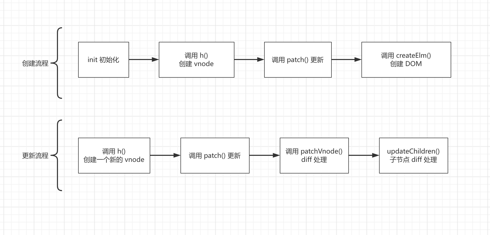
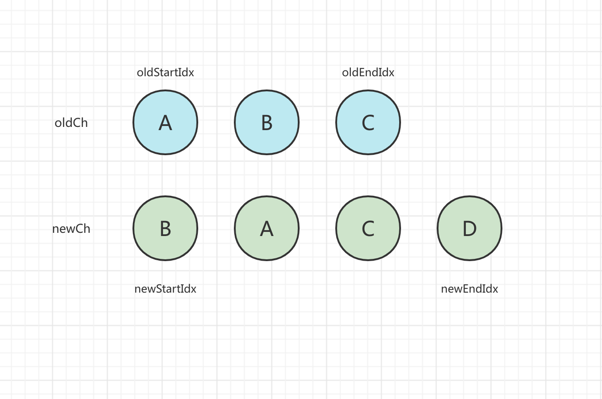
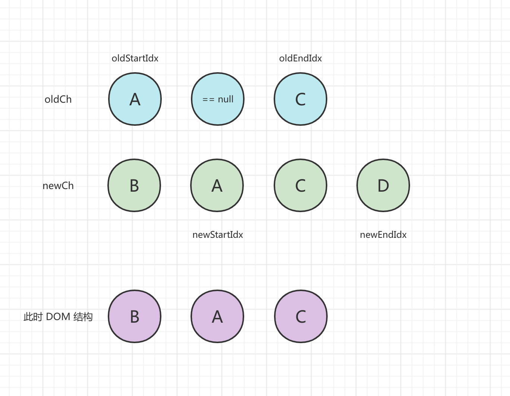
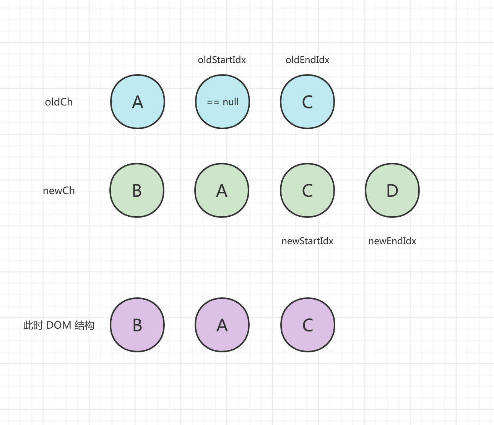
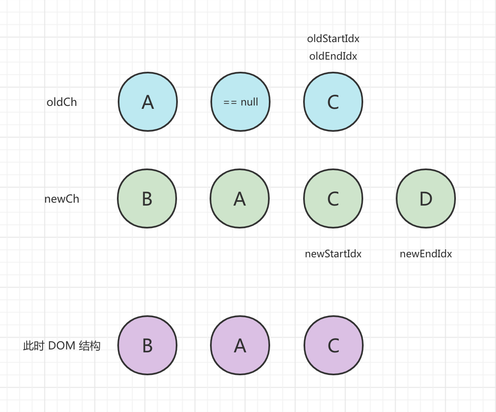
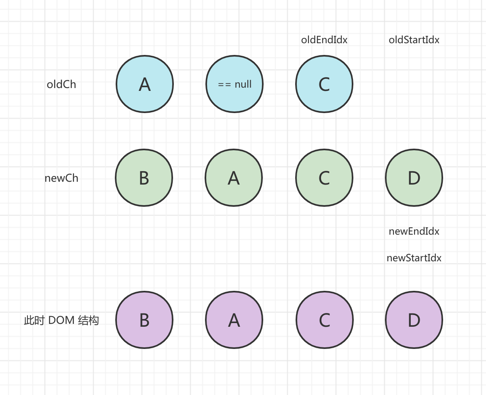

## 概述

React 和 Vue 中都有虚拟 DOM 的概念，我们应该如何理解和掌握虚拟 DOM 的精髓呢？我推荐大家学习 [Snabbdom](https://github.com/snabbdom/snabbdom) 这个项目。Snabbdom 是一个虚拟 DOM 实现库，推荐的原因一是代码比较少，核心代码只有几百行；二是 Vue 就是借鉴此项目的思路来实现虚拟 DOM 的；三是这个项目的设计/实现和扩展思路值得参考。

> [snabb](https://en.wiktionary.org/wiki/snabb) /snab/，瑞典语，意思是快速的。

调整好舒服的坐姿，打起精神我们要开始啦~ 要学习虚拟 DOM，我们得先知道 DOM 的基础知识和用 JS 直接操作 DOM 的痛点在哪里。

## DOM 的作用和类型结构

DOM（Document Object Model）是一种文档对象模型，用一个对象树的结构来表示一个 HTML/XML 文档，树的每个分支的终点都是一个节点（node），每个节点都包含着对象。DOM API 的方法让你可以用特定方式操作这个树，用这些方法你可以改变文档的结构、样式或者内容。

DOM 树中的所有节点首先都是一个 `Node`，`Node` 是一个基类。`Element`，`Text` 和 `Comment` 都继承于它。
换句话说，`Element`，`Text` 和 `Comment` 是三种特殊的 `Node`，它们分别叫做 `ELEMENT_NODE`,
`TEXT_NODE` 和 `COMMENT_NODE`，代表的是元素节点（HTML 标签）、文本节点和注释节点。其中 `Element` 还有一个子类是 `HTMLElement`，那 `HTMLElement` 和 `Element` 有什么区别呢？`HTMLElement` 代表 HTML 中的元素，如：`<span>`、`` 等，而有些元素并不是 HTML 标准的，比如 `<svg>`。可以用下面的方法来判断这个元素是不是 `HTMLElement`：

```javascript
document.getElementById('myIMG') instanceof HTMLElement;
```

## 为什么需要虚拟 DOM？

浏览器创建 DOM 是很“昂贵”的。来一个经典示例，我们可以通过 `document.createElement('div')` 创建一个简单的 div 元素，将属性都打印出来康康：


可以看到打印出来的属性非常多，当频繁地去更新复杂的 DOM 树时，会产生性能问题。虚拟 DOM 就是用一个原生的 JS 对象去描述一个 DOM 节点，所以创建一个 JS 对象比创建一个 DOM 对象的代价要小很多。

## VNode

Vnode 就是 Snabbdom 中描述虚拟 DOM 的一个对象结构，内容如下：

```typescript
type Key = string | number | symbol;

interface VNode {
  // CSS 选择器，比如：'div#container'。
  sel: string | undefined;
  
  // 通过 modules 操作 CSS classes、attributes 等。
  data: VNodeData | undefined; 
  
   // 虚拟子节点数组，数组元素也可以是 string。
  children: Array<VNode | string> | undefined;
  
  // 指向创建的真实 DOM 对象。
  elm: Node | undefined;
  
  /**
   * text 属性有两种情况：
   * 1. 没有设置 sel 选择器，说明这个节点本身是一个文本节点。
   * 2. 设置了 sel，说明这个节点的内容是一个文本节点。
   */
  text: string | undefined;
  
  // 用于查找已存在的 DOM，以键值对的形式存储在内存中，键为 key，值为 elm。
  key: Key | undefined;
}

interface VNodeData {
  props?: Props;
  attrs?: Attrs;
  class?: Classes;
  style?: VNodeStyle;
  dataset?: Dataset;
  on?: On;
  attachData?: AttachData;
  hook?: Hooks;
  key?: Key;
  ns?: string; // for SVGs
  fn?: () => VNode; // for thunks
  args?: any[]; // for thunks
  is?: string; // for custom elements v1
  [key: string]: any; // for any other 3rd party module
}
```

例如这样定义一个 vnode 的对象：

```typescript
const vnode = h(
  'div#container',
  { class: { active: true } },
  [
    h('span', { style: { fontWeight: 'bold' } }, 'This is bold'),
    ' and this is just normal text'
]);
```

我们通过 `h(sel, b, c)` 函数来创建 vnode 对象。`h()` 代码实现中主要是判断了 b 和 c 参数是否存在，并处理成 data 和 children，children 最终会是数组的形式。最后通过 `vnode()` 函数返回上面定义的 `VNode` 类型格式。

## Snabbdom 的运行流程

先来一张运行流程的简单示例图，先有个流程概念：



> diff 处理是用来计算新老节点之间差异的处理过程。

再来看一段  Snabbdom 运行的示例代码：

```javascript
import {
  init,
  classModule,
  propsModule,
  styleModule,
  eventListenersModule,
  h,
} from 'snabbdom';

const patch = init([
  // 通过传入模块初始化 patch 函数
  classModule, // 开启 classes 功能
  propsModule, // 支持传入 props
  styleModule, // 支持内联样式同时支持动画
  eventListenersModule, // 添加事件监听
]);

// <div id="container"></div>
const container = document.getElementById('container');

const vnode = h(
  'div#container.two.classes',
  { on: { click: someFn } },
  [
    h('span', { style: { fontWeight: 'bold' } }, 'This is bold'),
    ' and this is just normal text',
    h('a', { props: { href: '/foo' } }, "I'll take you places!"),
  ]
);

// 传入一个空的元素节点。
patch(container, vnode);

const newVnode = h(
  'div#container.two.classes',
  { on: { click: anotherEventHandler } },
  [
    h(
      'span',
      { style: { fontWeight: 'normal', fontStyle: 'italic' } },
      'This is now italic type'
    ),
    ' and this is still just normal text',
    h('a', { props: { href: ''/bar' } }, "I'll take you places!"),
  ]
);

// 再次调用 patch()，将旧节点更新为新节点。
patch(vnode, newVnode);
```

从流程示意图和示例代码可以看出，Snabbdom 的运行流程描述如下：

1. 首先调用 `init()` 进行初始化，初始化时需要配置需要使用的模块。比如 `classModule` 模块用来使用对象的形式来配置元素的 class 属性；`eventListenersModule` 模块用来配置事件监听器等等。`init()` 调用后会返回 `patch()` 函数。
2. 通过 `h()` 函数创建初始化 vnode 对象，调用 `patch()` 函数去更新，最后通过 `createElm()` 创建真正的 DOM 对象。
3. 当需要更新时，创建一个新的 vnode 对象，调用 `patch()` 函数去更新，经过 `patchVnode()` 和 `updateChildren()` 完成本节点和子节点的差异更新。

 Snabbdom 是通过模块这种设计来扩展相关属性的更新而不是全部写到核心代码中。那这是如何设计与实现的？接下来就先来康康这个设计的核心内容，Hooks——生命周期函数。

## Hooks

Snabbdom 提供了一系列丰富的生命周期函数也就是钩子函数，这些生命周期函数适用在模块中或者可以直接定义在 vnode 上。比如我们可以在 vnode 上这样定义钩子的执行：

```javascript
h('div.row', {
  key: 'myRow',
  hook: {
    insert: (vnode) => {
      console.log(vnode.elm.offsetHeight);
    },
  },
});
```
全部的生命周期函数声明如下：
| 名称        | 触发节点                         | 回调参数                |
| ----------- | :------------------------------- | ----------------------- |
| `pre`       | patch 开始执行                   | none                    |
| `init`      | vnode 被添加                     | `vnode`                 |
| `create`    | 一个基于 vnode 的 DOM 元素被创建 | `emptyVnode, vnode`     |
| `insert`    | 元素被插入到 DOM                 | `vnode`                 |
| `prepatch`  | 元素即将 patch                   | `oldVnode, vnode`       |
| `update`    | 元素已更新                       | `oldVnode, vnode`       |
| `postpatch` | 元素已被 patch                   | `oldVnode, vnode`       |
| `destroy`   | 元素被直接或间接得移除           | `vnode`                 |
| `remove`    | 元素已从 DOM 中移除              | `vnode, removeCallback` |
| `post`      | 已完成 patch 过程                | none                    |

其中适用于模块的是：`pre`, `create`,`update`, `destroy`, `remove`, `post`。适用于 vnode 声明的是：`init`, `create`, `insert`, `prepatch`, `update`,`postpatch`, `destroy`, `remove`。

我们来康康是如何实现的，比如我们以 `classModule` 模块为例，康康它的声明：

```typescript
import { VNode, VNodeData } from "../vnode";
import { Module } from "./module";

export type Classes = Record<string, boolean>;

function updateClass(oldVnode: VNode, vnode: VNode): void {
  // 这里是更新 class 属性的细节，先不管。
  // ...
}

export const classModule: Module = { create: updateClass, update: updateClass };
```

可以看到最后导出的模块定义是一个对象，对象的 key 就是钩子函数的名称，模块对象 `Module` 的定义如下：

```typescript
import {
  PreHook,
  CreateHook,
  UpdateHook,
  DestroyHook,
  RemoveHook,
  PostHook,
} from "../hooks";

export type Module = Partial<{
  pre: PreHook;
  create: CreateHook;
  update: UpdateHook;
  destroy: DestroyHook;
  remove: RemoveHook;
  post: PostHook;
}>;
```

TS 中 `Partial` 表示对象中每个 key 的属性都是可以为空的，也就是说模块定义中你关心哪个钩子，就定义哪个钩子就好了。钩子的定义有了，在流程中是怎么执行的呢？接着我们来看 `init()` 函数：

```typescript
// 模块中可能定义的钩子有哪些。
const hooks: Array<keyof Module> = [
  "create",
  "update",
  "remove",
  "destroy",
  "pre",
  "post",
];

export function init(
  modules: Array<Partial<Module>>,
  domApi?: DOMAPI,
  options?: Options
) {
  // 模块中定义的钩子函数最后会存在这里。
  const cbs: ModuleHooks = {
    create: [],
    update: [],
    remove: [],
    destroy: [],
    pre: [],
    post: [],
  };

  // ...

  // 遍历模块中定义的钩子，并存起来。
  for (const hook of hooks) {
    for (const module of modules) {
      const currentHook = module[hook];
      if (currentHook !== undefined) {
        (cbs[hook] as any[]).push(currentHook);
      }
    }
  }
  
  // ...
}
```

可以看到 `init()` 在执行时先遍历各个模块，然后把钩子函数存到了 `cbs` 这个对象中。执行的时候可以康康 `patch()` 函数里面：

```typescript
export function init(
  modules: Array<Partial<Module>>,
  domApi?: DOMAPI,
  options?: Options
) {
  // ...
  
  return function patch(
  oldVnode: VNode | Element | DocumentFragment,
   vnode: VNode
  ): VNode {
    // ...
    
    // patch 开始了，执行 pre 钩子。
    for (i = 0; i < cbs.pre.length; ++i) cbs.pre[i]();
    
    // ...
  }
}
```

这里以 `pre` 这个钩子举例，`pre` 钩子的执行时机是在 patch 开始执行时。可以看到 `patch()` 函数在执行的开始处去循环调用了 `cbs` 中存储的 `pre` 相关钩子。其他生命周期函数的调用也跟这个类似，大家可以在源码中其他地方看到对应生命周期函数调用的地方。

这里的设计思路是**观察者模式**。Snabbdom 把非核心功能分布在模块中来实现，结合生命周期的定义，模块可以定义它自己感兴趣的钩子，然后 `init()` 执行时处理成 `cbs` 对象就是注册这些钩子；当执行时间到来时，调用这些钩子来通知模块处理。这样就把核心代码和模块代码分离了出来，从这里我们可以看出观察者模式是一种代码解耦的常用模式。

## patch()

接下来我们来康康核心函数 `patch()`，这个函数是在 `init()` 调用后返回的，作用是执行 VNode 的挂载和更新，签名如下：

```typescript
function patch(oldVnode: VNode | Element | DocumentFragment, vnode: VNode): VNode {
    // 为简单起见先不关注 DocumentFragment。
    // ...
}
```

`oldVnode` 参数是旧的 VNode 或 DOM 元素或文档片段，`vnode` 参数是更新后的对象。这里我直接贴出整理的流程描述：

1. 调用模块上注册的 `pre` 钩子。

2. 如果 `oldVnode` 是 `Element`，则将其转换为空的 `vnode` 对象，属性里面记录了 `elm`。

   这里判断是不是 `Element` 是判断 `(oldVnode as any).nodeType === 1` 是完成的，`nodeType === 1` 表明是一个 ELEMENT_NODE，定义在 [这里](https://developer.mozilla.org/zh-CN/docs/Web/API/Node/nodeType)。

3. 然后判断 `oldVnode` 和 `vnode` 是不是相同的，这里会调用 `sameVnode()` 来判断：

   ```typescript
   function sameVnode(vnode1: VNode, vnode2: VNode): boolean {
     // 同样的 key。
     const isSameKey = vnode1.key === vnode2.key;
     
     // Web component，自定义元素标签名，看这里：
     // https://developer.mozilla.org/zh-CN/docs/Web/API/Document/createElement
     const isSameIs = vnode1.data?.is === vnode2.data?.is;
     
     // 同样的选择器。
     const isSameSel = vnode1.sel === vnode2.sel;
   
     // 三者都相同即是相同的。
     return isSameSel && isSameKey && isSameIs;
   }
   ```

   - 如果相同，则调用 `patchVnode()` 做 diff 更新。
   - 如果不同，则调用 `createElm()` 创建新的 DOM 节点；创建完毕后插入 DOM 节点并删除旧的 DOM 节点。

4. 调用上述操作中涉及的 vnode 对象中注册的 `insert` 钩子队列， `patchVnode()` `createElm()` 都可能会有新节点插入 。至于为什么这样做，在 `createElm()` 中会说到。

5. 最后调用模块上注册的 `post` 钩子。

流程基本就是相同的 vnode 就做 diff，不同的就创建新的删除旧的。接下来先看下 `createElm()` 是如何创建 DOM 节点的。

## createElm()

`createElm()` 是根据 vnode 的配置来创建 DOM 节点。流程如下：

1. 调用 vnode 对象上可能存在的 `init` 钩子。

2. 然后分一下几种情况来处理：

   1. 如果 `vnode.sel === '!'`，这是 Snabbdom 用来删除原节点的方法，这样会新插入一个注释节点。因为在 `createElm()` 后会删除老节点，所以这样设置就可以达到卸载的目的。

   2. 如果 `vnode.sel` 选择器定义是存在的：

      1. 解析选择器，得到 `id`、`tag` 和 `class`。
      2. 调用 `document.createElement()` 或 `document.createElementNS` 创建 DOM 节点，并记录到 `vnode.elm` 中，并根据上一步的结果来设置 `id`、`tag` 和 `class`。

      3. 调用模块上的 `create` 钩子。

      4. 处理 `children` 子节点数组：

         1. 如果 `children` 是数组，则递归调用 `createElm()` 创建子节点后，调用 `appendChild` 挂载到 `vnode.elm` 下。

         2. 如果 `children` 不是数组但 `vnode.text` 存在，说明这个元素的内容是个文本，这个时候调用 `createTextNode` 创建文本节点并挂载到 `vnode.elm` 下。

      5. 调用 vnode 上的 `create` 钩子。并将 vnode 上的 `insert` 钩子加入到  `insert` 钩子队列。

   3. 剩下的情况就是 `vnode.sel` 不存在，说明节点本身是文本，那就调用 `createTextNode` 创建文本节点并记录到 `vnode.elm`。

3. 最后返回 `vnode.elm`。

整个过程可以看出 `createElm()` 是根据 `sel` 选择器的不同设置来选择如何创建 DOM 节点。这里有个细节是补一下： `patch()` 中提到的 `insert` 钩子队列。需要这个 `insert` 钩子队列的原因是需要等到 DOM 真正被插入后才执行，而且也要等到所有子孙节点都插入完成，这样我们可以在 `insert` 中去计算元素的大小位置信息才是准确的。结合上面创建子节点的过程，`createElm()` 创建子节点是递归调用，所以队列会先记录子节点，再记录自身。这样在 `patch()` 的结尾执行这个队列时就可以保证这个顺序。

## patchVnode()

接下来我们来看 Snabbdom 如何用 `patchVnode()` 来做 diff 的，这是虚拟 DOM 的核心。`patchVnode()` 的处理流程如下：

1. 首先执行 vnode 上 `prepatch` 钩子。
2. 如果 oldVnode 和 vnode 是同一个对象引用，则不处理直接返回。
3. 调用模块和 vnode 上的 `update` 钩子。
4. 如果没有定义 `vnode.text`，则处理 `children` 的几种情况：
   1. 如果 `oldVnode.children` 和 `vnode.children` 均存在并且不相同。则调用 `updateChildren` 去更新。
   2. `vnode.children` 存在而 `oldVnode.children` 不存在。如果 `oldVnode.text` 存在则先清空，然后调用 `addVnodes` 去添加新的 `vnode.children`。
   3. `vnode.children` 不存在而 `oldVnode.children` 存在。调用 `removeVnodes` 移除 `oldVnode.children`。
   4. 如果 `oldVnode.children` 和 `vnode.children` 均不存在。如果 `oldVnode.text` 存在则清空。

5. 如果有定义 `vnode.text`并且与 `oldVnode.text` 不同。如果 `oldVnode.children` 存在则调用 `removeVnodes` 清除。然后通过 `textContent` 来设置文本内容。
6. 最后执行 vnode 上的 `postpatch` 钩子。

从过程可以看出，diff 中对于自身节点的相关属性的改变比如 `class`、`style` 之类的是依靠模块去更新的，这里不过多展开了大家有需要可以去看下模块相关的代码。diff 的主要核心处理是集中在 `children` 上，接下来康康 diff 处理 `children` 的几个相关函数。

### addVnodes()

这个很简单，先调用 `createElm()` 创建，然后插入到对应的 parent 中。

### removeVnodes()

移除的时候会先调用 `destory` 和 `remove` 钩子，这里重点讲讲这两个钩子的调用逻辑和区别。

- `destory`，首先调用这个钩子。逻辑是先调用 vnode 对象上的这个钩子，再调用模块上的。然后对 `vnode.children` 也按照这个顺序递归调用这个钩子。
- `remove`，这个 hook 只有在当前元素从它的父级中删除才会触发，被移除的元素中的子元素则不会触发，并且模块和 vnode 对象上的这个钩子都会调用，顺序是先调用模块上的再调用 vnode 上的。而且比较特殊的是等待所有的 `remove` 都会调用后，元素才会真正被移除，这样做可以实现一些延迟删除的需求。

以上可以看出这两个钩子调用逻辑不同的地方，特别是 `remove` 只在直接脱离父级的元素上才会被调用。

### updateChildren()

`updateChildren()` 是用来处理子节点 diff 的，也是  Snabbdom  中比较复杂的一个函数。总的思想是对  `oldCh` 和 `newCh` 各设置头、尾一共四个指针，这四个指针分别是 `oldStartIdx`、`oldEndIdx`、`newStartIdx` 和 `newEndIdx`。然后在 `while (oldStartIdx <= oldEndIdx && newStartIdx <= newEndIdx)` 循环中对两个数组进行对比，找到相同的部分进行复用更新，并且每次比较处理最多移动一对指针。详细的遍历过程按以下顺序处理：

1. 如果这四个指针有任何一个指向的 vnode == null，则这个指针往中间移动，比如：start++ 或 end--，null 的产生在后面情况有说明。
2. 如果新旧开始节点相同，也就是 `sameVnode(oldStartVnode, newStartVnode)` 返回 true，则用 `patchVnode()` 执行 diff，并且两个开始节点都向中间前进一步。
3. 如果新旧结束节点相同，也采用 `patchVnode()` 处理，两个结束节点向中间后退一步。
4. 如果旧开始节点与新结束节点相同，先用 `patchVnode()` 处理更新。然后需要移动 oldStart 对应的 DOM 节点，移动的策略是移动到 `oldEndVnode` 对应 DOM 节点的下一个兄弟节点之前。为什么是这样移动呢？首先，oldStart 与 newEnd 相同，说明在当前循环处理中，老数组的开始节点是往右移动了；因为每次的处理都是首尾指针往中间移动，我们是把老数组更新成新的，这个时候 oldEnd 可能还没处理，但这个时候 oldStart 已确定在新数组的当前处理中是最后一个了，所以移动到 oldEnd 的下一个兄弟节点之前是合理的。移动完毕后，oldStart++，newEnd--，分别向各自的数组中间移动一步。
5. 如果旧结束节点与新开始节点相同，也是先用 `patchVnode()` 处理更新，然后把 oldEnd 对应的 DOM 节点移动 `oldStartVnode` 对应的  DOM 节点之前，移动理由同上一步一样。移动完毕后，oldEnd--，newStart++。
6. 如果以上情况都不是，则通过 newStartVnode 的 key 去找在 `oldChildren` 的下标 idx，根据下标是否存在有两种不同的处理逻辑：
   1. 如果下标不存在，说明 newStartVnode 是新创建的。通过 `createElm()` 创建新的 DOM，并插入到 `oldStartVnode` 对应的 DOM 之前。
   2. 如果下标存在，也要分两种情况处理：
      1. 如果两个 vnode 的 sel 不同，也还是当做新创建的，通过 `createElm()` 创建新的 DOM，并插入到 `oldStartVnode` 对应的 DOM 之前。
      2. 如果 sel 是相同的，则通过 `patchVnode()` 处理更新，并把 `oldChildren` 对应下标的 vnode 设置为 undefined，这也是前面双指针遍历中为什么会出现 == null 的原因。然后把更新完毕后的节点插入到 `oldStartVnode` 对应的 DOM 之前。
   3. 以上操作完后，newStart++。

遍历结束后，还有两种情况要处理。一种是 `oldCh` 已经全部处理完成，而 `newCh` 中还有新的节点，需要对 `newCh` 剩下的每个都创建新的 DOM；另一种是 `newCh` 全部处理完成，而 `oldCh` 中还有旧的节点，需要将多余的节点移除。这两种情况的处理在 如下：

```typescript
  function updateChildren(
    parentElm: Node,
    oldCh: VNode[],
    newCh: VNode[],
    insertedVnodeQueue: VNodeQueue
  ) { 
    // 双指针遍历过程。
    // ...
      
    // newCh 中还有新的节点需要创建。
    if (newStartIdx <= newEndIdx) {
      // 需要插入到最后一个处理好的 newEndIdx 之前。
      before = newCh[newEndIdx + 1] == null ? null : newCh[newEndIdx + 1].elm;
      addVnodes(
        parentElm,
        before,
        newCh,
        newStartIdx,
        newEndIdx,
        insertedVnodeQueue
      );
    }
      
    // oldCh 中还有旧的节点要移除。
    if (oldStartIdx <= oldEndIdx) {
      removeVnodes(parentElm, oldCh, oldStartIdx, oldEndIdx);
    }
  }
```

我们用一个实际例子来看一下 `updateChildren()` 的处理过程：

1. 初始状态如下，旧子节点数组为 [A, B, C]，新节点数组为 [B, A, C, D]：



2. 第一轮比较，开始和结束节点都不一样，于是看 newStartVnode 在旧节点中是否存在，找到了在 oldCh[1] 这个位置，那么先执行 `patchVnode()` 进行更新，然后把 oldCh[1] = undefined，并把 DOM 插入到 `oldStartVnode` 之前，`newStartIdx` 向后移动一步，处理完后状态如下：



3. 第二轮比较，`oldStartVnode` 和 `newStartVnode` 相同，执行 `patchVnode()` 更新，`oldStartIdx` 和 `newStartIdx` 向中间移动，处理完后状态如下：



4. 第三轮比较，`oldStartVnode == null`，`oldStartIdx` 向中间移动，状态更新如下：



5. 第四轮比较，`oldStartVnode` 和 `newStartVnode` 相同，执行 `patchVnode()` 更新，`oldStartIdx` 和 `newStartIdx` 向中间移动，处理完后状态如下：


6. 此时 `oldStartIdx` 大于 `oldEndIdx`，循环结束。此时 `newCh` 中还有没处理完的新节点，需要调用 `addVnodes()` 插入，最终状态如下：



## 总结

到这里虚拟 DOM 的核心内容已经梳理完毕，[Snabbdom](https://github.com/snabbdom/snabbdom) 的设计和实现原理我觉得挺好的，大家有空可以去康康源码的细节再细品下，其中的思想很值得学习。
